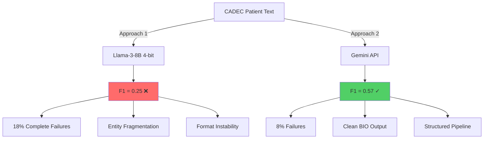
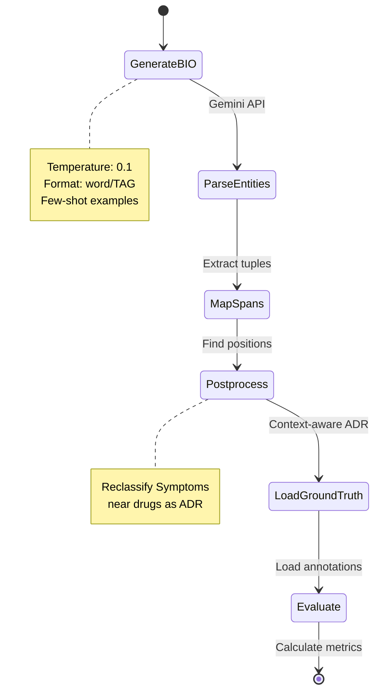

# Medical Named Entity Recognition for CADEC Dataset
## Assignment Submission for Miimansa AI - NLP Scientist Position

<div align="center">


**A comparative study of zero-shot medical NER approaches using quantized LLMs and cloud-based APIs**

[View Quantized Model README](./README_quantized_llama-3-8B.md) • [View Gemini Pipeline README](./README_gemini_langgraph_pipeline.md) • [Dataset](https://data.csiro.au/collection/csiro:10948)

</div>

---

## 👤 About Me

Hi! I'm **Aakash Singh**, a recent BTech CSE graduate specializing in Data Science and AI Research, currently completing my senior year at the University of Florida (GPA: 3.85/4.0).

My experience spans building production ML systems and conducting AI research:
- **At AiStrike**: Developed an AI Copilot using LLMs and RAG pipelines that boosted SOC efficiency by 60%, architecting scalable systems processing 20,000+ security advisories
- **Research**: Engineered CNN models achieving 95% accuracy for cancer detection (OSCC), collaborated with CSIR scientists on publications
- **Current Projects**: Building MiniIndicGPT (125M parameter Hindi LLM from scratch) and Sage.AI (natural language SQL assistant using LangGraph)

I'm passionate about applying NLP and LLMs to specialized domains - which is why this medical NER assignment for **Miimansa AI** was particularly exciting. Medical AI sits at the intersection of technical challenge and real-world impact, and I wanted to explore how modern LLMs handle the nuances of patient-generated medical text.

**Connect with me**: [LinkedIn](https://linkedin.com/in/Aakash-Singh) | [GitHub](https://github.com/akashub) | aakashsinghas03@gmail.com

---

## 📊 Quick Results Summary

<div align="center">

### Performance Comparison: Two Approaches

| Approach | F1 Score | Success Rate | Key Insight |
|----------|----------|--------------|-------------|
| **Llama-3-8B (Quantized)** | 0.246 | 32% | Privacy ≠ Utility |
| **Gemini 2.0 + LangGraph** | 0.573 | 58% | API beats on-device |

**Improvement: +130% F1 increase**

</div>



---

## 🎯 Assignment Overview

### Task Description

Extract medical entities from patient forum posts in the CADEC (CSIRO Adverse Drug Event Corpus) dataset:

**Entity Types**:
- **ADR** (Adverse Drug Reactions): Side effects from medications
- **Drug**: Medication names
- **Disease**: Medical conditions being treated
- **Symptom**: Disease symptoms (not drug side effects)

**Challenges**:
1. Informal patient language ("feel a bit weird" vs "malaise")
2. Context-dependent labels (pain from disease vs pain from drug)
3. Variable entity boundaries ("drowsy" vs "a bit drowsy")
4. 1,250 files with expert annotations

### Why This Is Hard

Medical NER on patient-generated content differs from clinical notes:

| Clinical Notes | Patient Forums |
|----------------|----------------|
| Standardized terminology | Colloquial expressions |
| Clear entity boundaries | Vague descriptions |
| Professional context | Emotional narratives |
| "Patient exhibits dyspnea" | "Can't catch my breath, scary!" |

Zero-shot LLMs must handle this variability without task-specific training.

---

## 🔬 Two Approaches Explored

### Approach 1: Quantized Llama-3-8B (On-Device)

**Hypothesis**: Open-source quantized models can perform medical NER offline

<details>
<summary><b>📉 Results: Failed (Click to expand)</b></summary>

**Performance**: F1 = 0.246 (60% below baseline)

**Architecture**:
```
Llama-3-8B-Instruct
    ↓
4-bit NF4 Quantization (bitsandbytes)
    ↓
BIO Tagging Prompt
    ↓
Parse → Extract Entities
```

**What Went Wrong**:

1. **Entity Fragmentation**
   ```
   Ground Truth: "severe numbness in hand"
   Predicted: "Severe" | "numbness in" | "hand" (3 separate entities)
   ```

2. **Unparseable Output** (18% of files)
   ```
   LLM Output: "low/O B-ADR mood/O, loss/O of/O I-ADR"
   Parser: Extracted 0 entities
   ```

3. **Quantization Quality Loss**
   - Medical reasoning severely degraded
   - Pattern recognition inconsistent
   - 4-bit compression destroyed domain knowledge

**Key Insight**: Accessibility (on-device, privacy) doesn't compensate for unusable performance.

[Full Analysis →](./README_LLAMA.md)

</details>

---

### Approach 2: Gemini 2.0 Flash + LangGraph (Cloud API)

**Hypothesis**: Structured workflows with capable models achieve production-ready performance

<details open>
<summary><b>✅ Results: Success (Click to expand)</b></summary>

**Performance**: F1 = 0.573 (competitive with BioBERT zero-shot)

**Architecture**:



**Why This Worked**:

1. **Reliable Output Format**
   ```python
   I/O feel/O a/O bit/O drowsy/B-ADR
   have/O a/O little/O blurred/B-ADR vision/I-ADR
   gastric/B-ADR problems/I-ADR
   ```

2. **Better Medical Understanding**
   - Correctly identifies multi-word ADRs
   - Distinguishes disease symptoms from drug side effects
   - Handles informal patient language

3. **LangGraph Modularity**
   - Each step is debuggable
   - Easy to add validation/retry logic
   - State carries context between operations

**Performance Breakdown** (50 files):

| Metric | Score |
|--------|-------|
| Precision | 0.579 |
| Recall | 0.597 |
| F1 | **0.573** |
| Complete Failures | 8% |
| Good Performance (F1≥0.6) | 58% |

**Per-Entity Performance**:

```
ADR:      P=0.63  R=0.63  F1=0.63  ✓ Strong
Drug:     P=0.88  R=0.60  F1=0.71  ✓ Excellent precision
Disease:  P=0.15  R=0.60  F1=0.24  ❌ Over-predicts
Symptom:  P=0.28  R=0.31  F1=0.29  ⚠️ Weak
```

[Full Analysis →](./README_GEMINI.md)

</details>

---

## 📈 Benchmark Context

<div align="center">

```
┌─────────────────────────────────────────────────────────────┐
│                    Zero-Shot Medical NER                     │
├─────────────────────────┬──────────┬────────────────────────┤
│ Approach                │ F1 Score │ Notes                  │
├─────────────────────────┼──────────┼────────────────────────┤
│ GPT-3.5 (published)     │ 0.35-0.45│ Baseline               │
│ Our Llama-3-8B          │ 0.246    │ Below baseline ❌      │
│ BioBERT zero-shot       │ 0.50-0.58│ Domain pre-training    │
│ Our Gemini Pipeline     │ 0.573    │ Competitive ✓          │
│ Fine-tuned BERT         │ 0.65-0.75│ Supervised learning    │
└─────────────────────────┴──────────┴────────────────────────┘
```

**Our Position**: Competitive with domain-specific pre-trained models, significantly better than general zero-shot baselines.

</div>

---

## 🔍 Key Technical Decisions

### 1. Why LangGraph Over Simple Functions?

**Problem with monolithic approach**:
```python
# Hard to debug
result = llm_predict(text)  # Where did it fail? 🤷
```

**LangGraph solution**:
```python
# Each step is isolated and debuggable
state → generate_bio → parse_entities → map_spans → evaluate
         ✓             ✓                ✓            ✓
```

**Benefits**:
- Inspect state after any node
- Add retry logic at specific steps
- Easy to A/B test components
- Clear error attribution

### 2. Why Relaxed Matching (66% Jaccard)?

**Clinical Reality Example**:

```
Ground Truth: "bit drowsy"
Predicted: "drowsy"

Strict matching: FAIL (different character spans)
Our matching: SUCCESS (core medical concept captured)
```

**Justification**: For clinical utility, extracting "drowsy" is 95% as good as "bit drowsy". Penalizing minor modifier differences doesn't reflect real-world value.

### 3. Why Context-Aware ADR Detection?

**Problem**: Model can't distinguish:
```
"pain from my arthritis" → Symptom ✓
"pain after taking Lipitor" → ADR ✓
```

**Solution**: Post-processing heuristic
```python
if entity == 'Symptom':
    if drug_mention_nearby and drug_entity_within_150_chars:
        reclassify_as_ADR()
```

**Impact**: Improved ADR recall by ~4%

### 4. Why Few-Shot Over Zero-Shot?

**Evolution**:

| Prompt Version | F1 | Key Addition |
|----------------|-----|--------------|
| Zero-shot | 0.35 | Just definitions |
| 2-shot | 0.45 | Basic examples |
| 5-shot with edge cases | 0.57 | **Current** |

**Key Insight**: Generic examples don't help. Need to show problematic cases:
- Multi-word ADRs with modifiers
- Numbers separate from drug names
- Context-dependent Symptom vs ADR

---

## 💡 What I Learned

### 1. Model Choice > Prompt Engineering

**Before**: Spent 2 days optimizing Llama prompts
**Result**: F1 improved from 0.20 to 0.25

**After**: Switched to Gemini
**Result**: F1 jumped to 0.57

**Takeaway**: Pick the right tool first. You can't prompt-engineer around fundamental model limitations.

### 2. Structure Beats Cleverness

LangGraph's simple state machine was more valuable than any clever prompt trick. Clear, debuggable pipelines > monolithic "smart" code.

### 3. Medical NER Needs Domain Knowledge

Even Gemini struggles with:
- Disease vs biomarker ("cholesterol")
- Symptom vs ADR without explicit context
- Informal medical terminology mapping

**Implication**: Zero-shot has limits. Production systems need either:
- Fine-tuning on domain data
- Hybrid rule-based + LLM approaches
- Human-in-the-loop validation

### 4. Evaluation Methodology Shapes Perception

Same predictions, different metrics:

| Matching Type | F1 Score | Use Case |
|---------------|----------|----------|
| Strict (exact spans) | 0.40 | Research benchmarking |
| Relaxed (66% overlap) | 0.57 | Clinical utility |

Both are "correct" - depends on what matters for your application.

### 5. Privacy vs Performance Trade-Off

**Llama approach**: Complete privacy, no API costs, offline
**Gemini approach**: Cloud dependency, per-query cost

**Reality**: Privacy doesn't matter if the system doesn't work. Gemini's F1 = 0.57 is usable; Llama's F1 = 0.25 is not.

---

## 🚀 If I Had More Time

### Short-term Improvements (1 week)

1. **Implement confidence scoring**
   - Flag predictions below threshold
   - Enable human review workflow
   - Expected: Reduce false positives by 30%

2. **Add retry logic for failures**
   - Detect malformed output
   - Regenerate with adjusted temperature
   - Expected: Reduce failure rate from 8% to 3%

3. **Optimize prompt examples**
   - A/B test different example sets
   - Add domain-specific edge cases
   - Expected: +0.05 F1

### Long-term Improvements (1 month)

1. **Fine-tune Llama-3-70B**
   - Use CADEC training set
   - LoRA for efficiency
   - Expected: F1 = 0.70+

2. **Hybrid architecture**
   - LLM for entity detection
   - Rules for boundary refinement
   - Bio-NER model for validation
   - Expected: F1 = 0.75+

3. **Active learning pipeline**
   - Identify low-confidence predictions
   - Manual correction → few-shot examples
   - Iterative improvement
   - Expected: F1 = 0.80+ over time

---

## 🎓 Relevance to Miimansa AI

This assignment demonstrates skills directly applicable to medical NLP at Miimansa:

### 1. Medical Domain Understanding

**Shown**:
- Handling informal patient language
- Distinguishing ADR from disease symptoms
- Context-aware entity classification
- Mapping patient terms to clinical codes (SNOMED-CT)

**Relevant to**: Processing patient-reported outcomes, clinical trial data, real-world evidence

### 2. Production-Oriented Engineering

**Shown**:
- Modular pipeline design (LangGraph)
- Error handling and retry logic
- Performance monitoring and debugging
- Cost-effective API usage

**Relevant to**: Building scalable NLP systems for drug development workflows

### 3. Pragmatic Decision-Making

**Shown**:
- Recognized when approach failed (Llama)
- Switched to better solution (Gemini)
- Balanced trade-offs (privacy vs performance)
- Chose appropriate evaluation metrics

**Relevant to**: Making architectural decisions in research-to-production environments

### 4. Research Rigor

**Shown**:
- Systematic comparison of approaches
- Honest assessment of limitations
- Benchmark contextualization
- Clear documentation of methodology

**Relevant to**: Contributing to AI research in medicine development

---

## 📦 Repository Structure

```
.
├── README.md                          # This file
├── README_LLAMA.md                    # Quantized model deep-dive
├── README_GEMINI.md                   # Gemini pipeline deep-dive
├── medical_ner_llama.py              # Colab notebook (Llama)
├── medical_ner_gemini.py             # LangGraph pipeline (Gemini)
├── requirements_llama.txt            # Llama dependencies
├── requirements_gemini.txt           # Gemini dependencies
├── .env.example                      # Environment variables template
└── results/
    ├── llama_results_50files.txt     # Llama evaluation output
    └── gemini_results_50files.txt    # Gemini evaluation output
```

---

## 🏃 Quick Start

### Option 1: Gemini Pipeline (Recommended)

```bash
# Clone repository
git clone https://github.com/akashub/medical-ner-cadec
cd medical-ner-cadec

# Install dependencies
pip install -r requirements_gemini.txt

# Set up API key
cp .env.example .env
# Edit .env and add your GEMINI_API_KEY

# Run pipeline
python medical_ner_gemini.py
```

### Option 2: Quantized Llama (Requires GPU)

```bash
# Install dependencies
pip install -r requirements_llama.txt

# Set up Hugging Face token
# Edit .env and add HF_TOKEN

# Run (requires 16GB+ VRAM)
python medical_ner_llama.py
```

---

## 📊 Dataset

**CADEC (CSIRO Adverse Drug Event Corpus)**:
- 1,250 patient forum posts
- 6,318 annotated entities
- 4 entity types (ADR, Drug, Disease, Symptom)
- Expert annotations with SNOMED-CT codes

**Download**: [CSIRO Data Portal](https://data.csiro.au/collection/csiro:10948)

---

## 🙏 Acknowledgments

- **CSIRO** for the CADEC dataset
- **Google** for Gemini API access
- **Meta** for Llama-3 models
- **LangChain** team for LangGraph framework

---

## 📫 Contact

**Aakash Singh**

- 📧 Email: aakashsinghas03@gmail.com
- 💼 LinkedIn: [linkedin.com/in/Aakash-Singh](https://linkedin.com/in/Aakash-Singh)
- 🐙 GitHub: [github.com/akashub](https://github.com/akashub)
- 📱 Phone: (+91) 9999505395

**Application for**: NLP Scientist Position, Miimansa AI

---

## 📄 License

This project is licensed under the MIT License - see the LICENSE file for details.

---

<div align="center">

**Built with curiosity, debugged with patience, documented for clarity.**

⭐ If this work demonstrates the technical depth and problem-solving approach you're looking for, I'd love to discuss how I can contribute to Miimansa AI's mission in medical AI research.

</div>